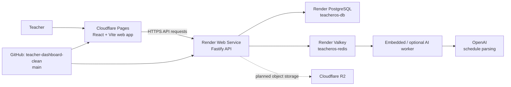
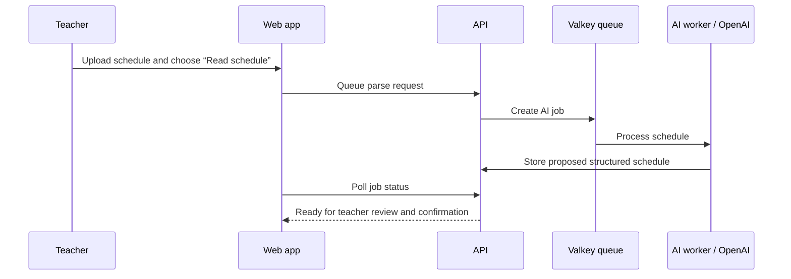

# TeacherDesk — Project Reference

> Living reference for the TeacherDesk / Calico Edu application.  
> Snapshot: August 12, 2026. Update this document whenever infrastructure, product scope, or deployment ownership changes. It intentionally excludes credentials, tokens, and passwords.

## Executive summary

TeacherDesk is a teacher-planning application. Its central job is to turn a teacher's schedule and course information into an approachable daily teaching workspace: courses, meeting times, plans, lessons, lesson segments, and classroom views.

The production source of truth is the GitHub repository **`aidanmccormick1/teacher-dashboard-clean`**. The production frontend is hosted on Cloudflare Pages and the API, PostgreSQL database, and Valkey/Redis are on Render. This is a deliberately hybrid setup; there is **no active migration of the API or database to Cloudflare Workers**.



## Canonical locations and services

| Purpose | Canonical location / service | Notes |
| --- | --- | --- |
| Production code repository | `https://github.com/aidanmccormick1/teacher-dashboard-clean` | Primary source of truth. Work from this repository. |
| Local production checkout | `/Users/aidanmccormick/Desktop/teacher-dashboard-clean` | Current working repository. |
| Frontend | `https://teacher-dashboard-clean.pages.dev` | Cloudflare Pages production site. |
| Backend API | `https://teacheros-api.onrender.com` | Render Node/Fastify service. |
| API health | `https://teacheros-api.onrender.com/health/readiness` | Returns readiness JSON when healthy. |
| Database | Render PostgreSQL: `teacheros-db` | Paid Render PostgreSQL instance. |
| Queue/cache | Render Valkey: `teacheros-redis` | Used for AI job queueing. |
| Object storage | Cloudflare R2 | Intended for uploads; not yet confirmed as configured in the API. |

### Important repository warning

`/Users/aidanmccormick/Desktop/teacher-platform-clean` and GitHub repository `aidanmccormick1/teacher-platform` are a legacy/parallel project. They were initially confused with the live application, but the TeacherDesk screenshot and Cloudflare Pages site correspond to **`teacher-dashboard-clean`**. Do not move changes between the repositories blindly or describe changes in the legacy repository as deployed production work.

## Technology and repository layout

This is a Node monorepo managed with npm workspaces.

| Path | Responsibility |
| --- | --- |
| `apps/web` | React + Vite single-page application. |
| `apps/api` | Fastify TypeScript API and REST routes. |
| `apps/worker` | Optional BullMQ worker application. |
| `packages/db` | Drizzle schema, database access, and migrations. |
| `packages/contracts` | Shared Zod contracts/types. |
| `packages/ai-worker` | Schedule AI parsing/worker implementation. |
| `ops/` | Smoke tests, operational scripts, and runbooks. |
| `infra/` | Cloudflare Pages and R2 setup documentation. |
| `render.yaml` | Render service blueprint/reference configuration. |
| `.github/workflows/ci.yml` | GitHub quality workflow. |

The frontend uses `VITE_API_BASE_URL` to reach the Render API. Production configuration in `apps/web/.env.production` points it to `https://teacheros-api.onrender.com`.

## Deployment ownership and configuration

### GitHub

GitHub holds the code and runs CI. The `main` branch is the production branch used by Cloudflare Pages and Render.

### Cloudflare Pages

Cloudflare Pages is only responsible for the frontend SPA.

Expected Pages configuration:

| Setting | Value |
| --- | --- |
| Framework | Vite |
| Root directory | `apps/web` |
| Build command | `npm ci && npm --workspace @teacheros/web run build` |
| Output directory | `apps/web/dist` |
| Node version | 20 |
| Required frontend environment | `VITE_API_BASE_URL=https://teacheros-api.onrender.com` |
| Other frontend environment | Clerk publishable key; optional Sentry configuration |

Reference: `infra/cloudflare-pages.md`.

### Render API

The Render service is `teacheros-api`. It previously pointed at the wrong GitHub repository (`teacher-platform`), creating a split frontend/backend setup. It was corrected to use `aidanmccormick1/teacher-dashboard-clean`, branch `main`.

Current configured commands:

```text
Build: npm ci --include=dev && npm --workspace @teacheros/contracts run build && npm --workspace @teacheros/db run build && npm --workspace @teacheros/ai-worker run build && npm --workspace @teacheros/api run build
Start: npm --workspace @teacheros/db run db:migrate && npm --workspace @teacheros/api run start
```

The API runs database migrations on startup. The database migrations observed during the corrected deployment were already applied and safely skipped.

### Render database and Valkey

The Render PostgreSQL database is the persistent source of application data. The Render Valkey instance supports queueing and caching, notably the AI job flow. Their connection details must remain Render environment secrets and must never be committed to the repository.

### Cloudflare R2

R2 is the intended home for uploaded artifacts, such as schedule source files. At the time of this snapshot, the API capability endpoint reports S3/R2 storage as unavailable. R2 should be configured with the bucket endpoint and restricted credentials in Render environment variables, then verified through an upload flow. Reference: `infra/cloudflare-r2.md`.

## Verified operating state (August 12, 2026)

| Check | Result | Evidence / meaning |
| --- | --- | --- |
| Render API deployment from correct repo | Passed | Render build completed after source correction. |
| Database migrations | Passed | All known migrations were safely recognized/applied. |
| API readiness | Passed | `/health/readiness` returned HTTP 200 with `ok: true`. |
| API capabilities | Partially passed | Database, Redis, AI queue, embedded AI worker, and OpenAI reported available. S3/R2 reported unavailable. |
| Production smoke test | Passed for public endpoints | `npm run ops:smoke:production` passed web root, SPA routes, and API liveness/readiness/capabilities. |
| GitHub CI for dashboard gate commit | Passed | The GitHub quality workflow succeeded for commit `f5cbd8c`. It runs install, typecheck, lint, tests, and build. |
| Full authenticated AI-import test | Pending | Requires authorization to use the production OpenAI key and an authenticated test flow. |
| Cloudflare Pages deployment of latest dashboard gate | Pending | Site was still serving an older frontend bundle at the snapshot. |

The exact capabilities response at the snapshot was logically equivalent to:

```json
{
  "database": true,
  "redis": true,
  "aiQueue": true,
  "aiWorker": true,
  "openai": true,
  "s3": false
}
```

## Why the backend timeout/waking error happened

The Render API service was on a **Free** plan. Render explicitly warns that an inactive free web service can take roughly 50 seconds or longer to wake. The frontend's message saying the backend is taking too long is consistent with that cold-start behavior.

The wrong-repository Render configuration was an additional reliability problem and has been corrected. It did not by itself remove free-plan cold starts.

### Recommended service decision

Keep the current architecture (Cloudflare Pages + Render API/database/Valkey). Upgrade **the Render API web service** from Free to a paid always-on plan if teachers are expected to use the product without wait/retry messages. The database being paid does not keep the separate API service awake.

## Product vision and requirements gathered so far

TeacherDesk should feel like a guided teaching assistant, especially for teachers who are not comfortable with technology. The product should avoid a dense dashboard before any setup has occurred and should make the next action obvious.

### Onboarding and empty state

Required experience:

- When no schedule/course information has been imported, do not show misleading readiness scores, empty analytics, or a dense dashboard.
- Present one prominent action: import a schedule to unlock the workspace.
- Keep a lightweight checklist/path for later steps, but frame it as a friendly guide rather than a wall of controls.
- Use plain-language buttons, confirmations, and one meaningful task per screen/step.

Implemented in the canonical repository:

- Commit `f5cbd8c` adds an empty-workspace dashboard gate.
- It shows **“Import your schedule to unlock TeacherDesk”** and routes the teacher to the schedule-import area.
- The gate is deployed to Cloudflare Pages and verified in the production bundle.

### Schedule import journey

The import flow needs to be a clear, sequential walkthrough:

1. **Upload** — choose the schedule file and immediately show a clear uploaded/received confirmation.
2. **Read the schedule** — teacher intentionally presses one button to start AI analysis; this should not silently happen below the upload section.
3. **Review findings** — present proposed classes, days, rooms, start times, and end times in a simple review section.
4. **Confirm/import** — teacher approves the proposed schedule before it creates classes.
5. **Finish setup** — direct them to courses, plans, and the next recommended action.

The importer must parse both start and end times when that information is in the uploaded schedule. It should explain what was recognized and clearly identify anything that needs the teacher to correct.

Implemented in the canonical repository:

- Commit `f2a7095` changes schedule reading from a long synchronous browser request to the existing queued AI-job flow.
- The import UI now presents clear stages: **Step 1: add a schedule**, **Step 2: read it**, and **Step 3: review before saving**.
- Pasted schedule text now exposes the same “Read my schedule” action as an uploaded image or PDF.
- The UI polls the queued job, shows background progress, and keeps the existing cancellation/retry controls instead of leaving the teacher with a request timeout.
- The API accepts up to 16 MiB JSON request bodies so the documented 10 MiB schedule-file limit still works after base64 encoding. Fastify's default 1 MiB limit previously caused HTTP 413 “Payload Too Large” before a job could be queued.
- The schedule reader uses `gpt-4o` in the Render service configuration. The prior schedule model could return a completed response with no usable final JSON message; `gpt-4o` completed a production queue test successfully.
- AI worker calls have a 75-second hard timeout, so an upstream stall becomes a retryable/visible failure instead of a permanently running 35% job. The response parser scans all model output items (reasoning models can put the final message after an internal reasoning item) and normalizes common teacher-readable time ranges for review.

### Scheduling

Requested scheduling improvements:

- Store and display class start **and end** times.
- Provide a visually clear weekly schedule view.
- Make the schedule useful for seeing the whole teaching week, not just isolated meeting records.
- Maintain class days, rooms, and course connections.

### Planning and lesson management

Requested planning improvements:

- Add account-specific/private teacher text and notes.
- Add a year timeline/course pacing view.
- Support stackable lessons: create, group/stack, rearrange, and manage lesson ordering.
- Let a teacher plan duration in weeks, class periods, or days where appropriate.
- When a teacher enters weeks, automatically estimate/fill the corresponding class periods based on the course meeting pattern, with an obvious way to adjust the result.

### Classroom and beginner-friendly design

The classroom area should remain useful after setup, but the entire app should guide a first-time teacher from setup to daily use. Each phase should say what it is for, what the teacher needs to do, and what happens next. Avoid presenting many competing controls at once.

## Dashboard behavior

The screenshot captured before the current frontend deployment showed a “Daily Desk” dashboard with empty counts, a low readiness ring, and a multi-step checklist. That presentation is confusing when there is no imported data, because it makes an unconfigured account look partially configured.

The new empty-state behavior should replace that first impression with the import-to-unlock message. Once a schedule or course data exists, the normal Daily Desk, readiness, classes, plans, and checklist can appear.

## AI schedule import architecture and test plan

The API exposes queued AI parsing. The expected high-level path is:



Relevant API behavior:

- Queue endpoint: `POST /v1/ai/parse-schedule/queue`
- Job polling endpoint: `GET /v1/ai/jobs/{id}`
- Production smoke script can queue and poll an AI job when configured with an authenticated test token.

### Safe live test needed

A full production test remains necessary because feature flags/capabilities being healthy does not prove a real teacher file can be read, parsed, reviewed, and imported.

Before sending a real schedule to OpenAI, confirm which production OpenAI project/key should be used. Do not print, commit, or paste the key. Then run an authorized test account through:

1. Upload a representative, non-sensitive schedule sample.
2. Confirm upload acknowledgment in the UI.
3. Start AI reading explicitly.
4. Confirm the job reaches a completed state instead of timing out.
5. Verify proposed courses, class days, rooms, start times, and end times.
6. Confirm import and check the weekly schedule/dashboard result.
7. Remove the test data if it is not intended to remain.

The operational script supports this with environment flags such as `PILOT_TOKEN`, `REQUIRE_AI_CAPABILITIES=1`, and `SMOKE_AI_QUEUE=1`; values belong in a local secure environment or CI secret, never in docs or git.

## Current release and deployment status

### Backend

The backend is currently healthy and deployed from the correct GitHub project. The corrected Render deployment included commit `f5cbd8c`.

### Frontend

The Cloudflare Pages project uses manual asset uploads rather than a GitHub deployment connection. The production bundle for commit `f2a7095` was uploaded successfully on August 12, 2026 and verified to contain the guided queued-import UI. Public web routes and API health/capability checks passed after deployment.

For future frontend releases, build the web workspace, deploy `apps/web/dist` with Wrangler to the `teacher-dashboard-clean` Pages project, then verify the production bundle and smoke checks. Do not assume a GitHub push will deploy Pages automatically while the project remains manually-uploaded.

## Operational checks

Run commands from `/Users/aidanmccormick/Desktop/teacher-dashboard-clean`.

| Goal | Command | Notes |
| --- | --- | --- |
| Install | `npm ci` | Use a clean dependency install. |
| Local quality checks | `npm run build && npm test -- --run` | Local command had a subprocess hang once; treat a completed GitHub CI run as the current confirmed quality result until local tooling is investigated. |
| Production public smoke | `npm run ops:smoke:production` | Checks Pages/API public routes and health/capabilities. |
| API readiness | `curl https://teacheros-api.onrender.com/health/readiness` | Safe public health check. |
| Git status | `git status --short` | Review local changes before staging/committing. |

### Deployment checks after any relevant change

1. Ensure the correct repository and branch contain the commit.
2. Confirm GitHub CI passed.
3. Confirm Render deployed the same commit when API/database/worker code changed.
4. Confirm Cloudflare Pages deployed the same commit when frontend code changed.
5. Run production smoke checks.
6. For AI/import changes, run an authenticated end-to-end test with a safe representative file.

## Known gaps, risks, and follow-up work

| Priority | Item | Why it matters | Recommended next action |
| --- | --- | --- | --- |
| High | Render API cold starts | Teachers can see backend timeout/waking messages. | Upgrade the Render API web service to an always-on paid plan. |
| High | Cloudflare Pages old production bundle | The live frontend does not yet show the dashboard import gate. | Sign in to Cloudflare and deploy current `main`. |
| Medium | File-based AI import E2E verification | A production queue test with a safe pasted schedule succeeded; a representative image/PDF should still be checked after major model or upload changes. | Run a safe image/PDF sample through upload → read → review → apply. |
| High | R2/storage capability unavailable | File upload persistence may be incomplete or use an alternate path. | Configure and verify Cloudflare R2 in Render; confirm `s3` capability becomes true. |
| Medium | Guided import UX | Existing flow must become visibly step-by-step and low-overwhelm. | Design and implement the explicit upload → read → review → confirm journey. |
| Medium | Start/end time support and weekly view | Core teacher scheduling requirements are not fully confirmed as implemented. | Inspect schema/UI, add data migration/API/UI, and test importer parsing. |
| Medium | Year plan / stackable lessons | Requested planning model needs detailed implementation. | Define data model and drag/reorder interactions, then build incrementally. |
| Medium | Private notes/text | Teachers need account-specific text. | Define scope, privacy, autosave behavior, and UI placement. |
| Low | Documentation mismatch | Some older README language refers to Neon PostgreSQL, while production uses Render PostgreSQL. | Update general docs once the platform configuration is stable. |

## Working principles for future changes

- Treat GitHub `teacher-dashboard-clean/main` as the one production code source.
- Keep secrets in hosting-provider environment variables; never add them to markdown, commits, screenshots, or chat.
- Make setup work before adding dashboard sophistication: a teacher without data should always see one clear next step.
- For potentially destructive import actions, show a review and explicit confirmation before creating classes/meeting records.
- Preserve real teacher data during schema or import changes. Use migrations, backups, and test accounts.
- Test the actual hosted app, not only a local build, for auth, AI, file uploads, and deployment behavior.
- Do not rely on free API hosting for a classroom-facing product that needs prompt response times.

## Decision log

| Date | Decision | Rationale |
| --- | --- | --- |
| Aug. 12, 2026 | Use `teacher-dashboard-clean` as production source of truth. | It matches the live TeacherDesk Cloudflare Pages app and screenshot. |
| Aug. 12, 2026 | Keep Cloudflare Pages for the frontend and Render for API/database/Valkey. | Existing services are already wired; migrating backend/database to Cloudflare would be unnecessary scope and risk. |
| Aug. 12, 2026 | Repoint Render API to `teacher-dashboard-clean/main`. | It was incorrectly building the parallel legacy repository. |
| Aug. 12, 2026 | Add a dashboard import gate before normal empty statistics/readiness. | An unconfigured account should be guided into setup rather than shown misleading empty dashboard content. |
| Aug. 12, 2026 | Use queued AI jobs for schedule reading. | Synchronous schedule parsing held the browser request open and could surface a timeout even when the worker infrastructure was available. |
| Aug. 12, 2026 | Deploy Pages manually with Wrangler. | The Cloudflare Pages project has no active Git connection; a GitHub push alone does not update the public frontend. |

## Useful references in the repository

- `README.md` — project overview (verify hosting details against this reference; some portions may be older).
- `infra/cloudflare-pages.md` — Pages configuration.
- `infra/cloudflare-r2.md` — R2 configuration.
- `ops/runbooks/alerts-and-slos.md` — service monitoring guidance.
- `ops/runbooks/backup-restore.md` — backup and restore guidance.
- `ops/runbooks/cutover-checklist.md` — deployment/cutover checklist.
- `ops/scripts/production_smoke.sh` — hosted smoke checks, including optional authenticated AI queue verification.
- `render.yaml` — Render service blueprint/reference.

## Next recommended build sequence

1. Get the current Cloudflare Pages frontend deployment live and verify the import-to-unlock empty state.
2. Eliminate API cold starts by upgrading the Render API service.
3. Configure/verify R2 upload storage and run a complete authenticated AI schedule-import test.
4. Rebuild the schedule import UI into explicit, confirmed stages.
5. Add start/end time data support and a weekly schedule view.
6. Add the year timeline, duration calculations, stackable/reorderable lessons, and private teacher notes.
7. Repeat end-to-end tests from a first-time teacher’s perspective after each major stage.
